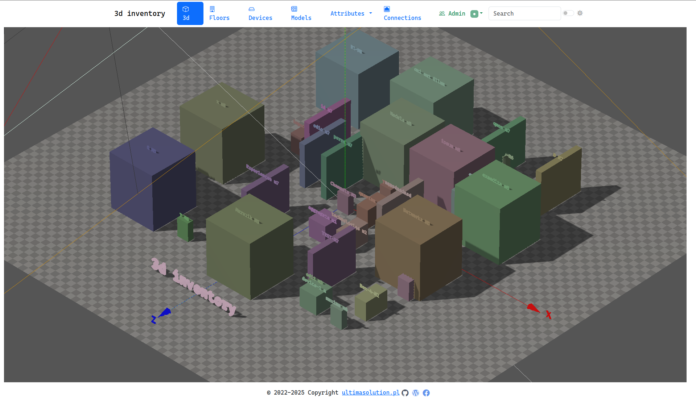
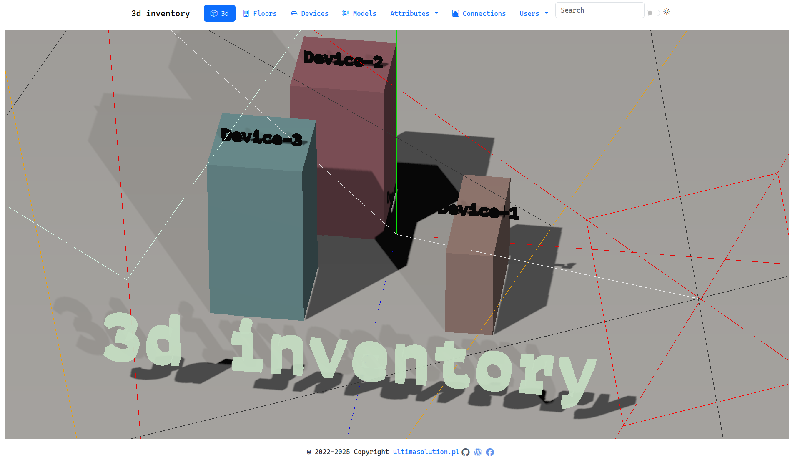

# 3d inventory

1. [3d inventory](#3d-inventory)
   1. [Project Overview and Purpose](#project-overview-and-purpose)
   2. [Data Model Philosophy](#data-model-philosophy)
   3. [Technology stack](#technology-stack)
   4. [Activity Monitoring and Audit Capabilities](#activity-monitoring-and-audit-capabilities)
      1. [Admin Dashboard](#admin-dashboard)
      2. [Change Tracking Details](#change-tracking-details)
   5. [Demo video](#demo-video)
   6. [Data Model](#data-model)
      1. [Logical model](#logical-model)
   7. [Application](#application)
      1. [Key Features](#key-features)
      2. [List devices](#list-devices)
      3. [Models](#models)
      4. [Attributes](#attributes)
      5. [Attribute Dictionary](#attribute-dictionary)
      6. [Connections](#connections)
   8. [Run](#run)
   9. [Deploy](#deploy)
      1. [Latest Features (December 7, 2025)](#latest-features-december-7-2025)
      2. [Previous Features (October 12, 2025)](#previous-features-october-12-2025)
      3. [Backend Container (Node.js API)](#backend-container-nodejs-api)
      4. [Infrastructure Features](#infrastructure-features)
   10. [Documentation](#documentation)
       1. [📚 **Core Documentation**](#-core-documentation)
       2. [🔒 **Security \& Configuration**](#-security--configuration)
       3. [🚀 **Deployment Resources**](#-deployment-resources)
       4. [🔧 **Development Guides**](#-development-guides)
       5. [📝 **Quick Reference**](#-quick-reference)
   11. [License](#license)


## Project Overview and Purpose

The 3D Inventory Angular UI is a comprehensive frontend application designed to create spatial and database representations of warehouses and datacenters. This project serves as a practical sandbox for exploring database systems while building an efficient platform for graphical IT inventory management. The application leverages modern web technologies to provide interactive 3D visualization combined with robust data management capabilities.

]

## Data Model Philosophy

The data model employs a unique parametric, generic attribute class approach. Rather than rigid table structures, all attributes for Devices, Models, and Connections are stored flexibly in this model. The system uses an Attribute Dictionary to define parameter types, which then govern how values are stored and validated. This design provides significant flexibility while maintaining data integrity.

## Technology stack

The application is built on Angular 20.3+ using the modern standalone component architecture, which eliminates the need for traditional NgModules and simplifies the application structure. For the user interface, it employs Bootstrap 5.3+ to ensure responsive design across different devices. The standout feature is the integration of three.js 163+, an advanced 3D graphics library that powers the interactive spatial visualization of inventory items.

Security is enhanced through Google reCAPTCHA v3, which provides invisible, score-based bot protection without disrupting the user experience. The backend supports both MongoDB Atlas and Oracle databases, demonstrating flexibility in handling both NoSQL and relational data models. All communication happens through a well-documented REST API using Swagger/OpenAPI specifications. The entire stack is containerized using Docker, and testing is handled by Jest, ensuring comprehensive test coverage and code quality.

- `Angular` 20.3+ - Modern standalone component architecture
- `Bootstrap` 5.3+ - Responsive UI framework
- `three.js` 163+ - Interactive 3D graphics library
- `Google reCAPTCHA v3` - Bot protection and security (invisible, score-based)
- `MongoAtlas`|`Oracle` - I want to try different solutions and data structures, including both relational and NoSQL data models using MongoAtlas and Oracle.
- `REST` - prepared `API` documented and used in `Swagger`.
- `Docker` as containers
- `Jest` - Modern testing framework with comprehensive test coverage

## Activity Monitoring and Audit Capabilities

### Admin Dashboard

Administrators have access to a powerful Activity Logs Dashboard that provides comprehensive audit trails for all system operations. The dashboard offers sophisticated filtering capabilities allowing searches by:

- Component type (device, model, floor, user, connection, etc.)
- Operation type (create, update, delete, clone)
- Date range for temporal analysis
- Username or object details for specific investigations

### Change Tracking Details

The system implements detailed before/after value tracking for all updates, providing granular visibility into what changed. This includes:

- Field-level change detection tracking modifications to names, positions, attributes, and other properties
- Visual before → after display making changes immediately apparent
- Smart formatting that handles different data types appropriately (coordinates, arrays, objects)

Every log entry includes user context, showing who performed each action, creating a complete accountability trail that's essential for compliance and troubleshooting.

## Demo video

The `3d inventory` project leverages `Angular` for building the user interface and utilizes the `three.js` library to render interactive 3D graphics.

[](https://youtu.be/rNOxpZ0ti1Q '3-d inventory the video')

## Data Model

The data model is based on a parametric, generic attribute class. All attributes for `Devices`, `Models`, and `Connections` are stored in this model.

Parameter types are defined in the `Attribute Dictionary`.

Attributes store values defined in the `Attribute Dictionary` for `Devices`, `Models`, and `Connections`. The `Attribute Dictionary` specifies parameters for these entities.

I had a lot of fun learning how to convert relational DB structures to correct collections in NoSQL MongoDB.

### Logical model

Relational data model is mapped to a NoSQL model in MongoDB.


## Application

The 3D Inventory UI provides a comprehensive interface for managing inventory with spatial visualization and complete audit tracking.

### Key Features

#### 🎯 **Inventory Management**

- **3D Visualization**: Interactive three.js-based 3D floor plans
- **Device Management**: Create, edit, delete, and position devices on floor plans
- **Model Management**: Define device types, categories, and specifications
- **Connection Tracking**: Visualize and manage connections between devices
- **Attribute System**: Flexible metadata management with attribute dictionaries

#### 🔐 **User Management**

- **Role-Based Access**: Admin, User, and Viewer permission levels
- **User Profiles**: Personal profile management with login history
- **Authentication**: Secure JWT-based authentication with password requirements
- **Account Security**: Login attempt tracking and account protection
- **Bot Protection**: Google reCAPTCHA v3 integration on login (invisible, score-based)

#### 📊 **Activity Monitoring & Audit Logs**

- **Activity Logs Dashboard** (Admin): Comprehensive audit trail for all system operations
  - Filter by component (device, model, floor, user, connection, etc.)
  - Filter by operation type (create, update, delete, clone)
  - Filter by date range
  - Search by username or object details
- **Change Tracking**: Detailed before/after value tracking for all updates
  - Field-level change detection (name, position, attributes, etc.)
  - Visual before → after display for modified values
  - Smart formatting for different data types (coordinates, arrays, objects)
- **Login History**:
  - View login attempts with success/failure status
  - IP address and timestamp tracking
  - Color-coded status indicators (success/failed/error)
  - Available in user profile and admin user management
- **User Context**: Every log entry includes who performed the action

### List devices


### Models


### Attributes


### Attribute Dictionary


### Connections


## Run

> 📖 **For complete setup and deployment instructions, see [DEPLOYMENT.md](DEPLOYMENT.md)**

```bash
git clone https://github.com/karol-preiskorn/3d-inventory-angular-ui.git
cd 3d-inventory-angular-ui
npm install
npm run start
```

Goto in browser [http://localhost:4200](http://localhost:4200)
<http://localhost:4200/>

## Deploy

> 📖 **For comprehensive deployment guide including Docker, Google Cloud Run, and troubleshooting, see [DEPLOYMENT.md](DEPLOYMENT.md)**

The application is deployed to Google Cloud Run:

- **Production URL**: <https://d-inventory-ui-wzwe3odv7q-ew.a.run.app>
- **Current Revision**: d-inventory-ui-00110-q8s
- **Backend API**: <https://d-inventory-api-wzwe3odv7q-ew.a.run.app>
- **Backend Revision**: d-inventory-api-00108-pr2

### Latest Features (December 7, 2025)

- ✅ **Google reCAPTCHA v3 Integration** - Invisible bot protection on login
- ✅ **Enhanced Security** - Score-based reCAPTCHA with token validation
- ✅ **RecaptchaService** - Comprehensive service with 11 passing tests
- ✅ **Environment Configuration** - Configured for both development and production
- ✅ **Documentation** - Complete setup guides and implementation docs

### Previous Features (October 12, 2025)

- ✅ Device change tracking with before/after values
- ✅ Activity Logs dashboard for administrators
- ✅ Login history tracking with IP addresses
- ✅ Enhanced audit trail for all CRUD operations
- ✅ Smart value formatting in activity logs

**Optimizations:**

- Multi-stage build reduces final image size
- Aggressive caching for static assets (js, css, images) - 1 year expiration
- No caching for HTML files to ensure updates are received immediately
- Gzip compression enabled for all text-based resources
- Security headers (CSP, X-Frame-Options, X-XSS-Protection)
- Health check endpoint at `/health` for container orchestration

### Backend Container (Node.js API)

**Technology Stack:**

- **Base Image**: `node:22-slim` (both build and runtime stages)
- **Runtime User**: Non-root `node` user for security
- **Container Port**: 8080 (configurable via PORT environment variable)
- **Health Check**: `/health` endpoint with 30s intervals

**Build Configuration:**

```bash
# Local Docker build and run
npm run docker:run      # Builds and runs container on port 8080:8080

# Multi-stage build process:
# 1. Builder stage: Compiles TypeScript to JavaScript
# 2. Runtime stage: Production dependencies only, runs compiled code
```

**Optimizations:**

- Separate build and runtime stages minimize final image size
- Production dependencies only in runtime image
- Node.js memory optimization: `--max-old-space-size=512`
- UV thread pool size: 8 for optimal MongoDB connections
- Health checks for Cloud Run and Kubernetes compatibility


### Infrastructure Features

- **Auto-scaling**: Scales from 0 to multiple instances based on traffic
- **Zero-downtime Deployments**: Gradual traffic migration to new revisions
- **HTTPS by Default**: Automatic SSL/TLS certificates via Google-managed certificates
- **Health Checks**: Container health monitoring with automatic restart on failures
- **Environment Variables**: Secure configuration management via Cloud Run environment
- **CI/CD Integration**: Automated builds and deployments via bash scripts

## Documentation

The project includes comprehensive documentation to support development, deployment, and maintenance:

### 📚 **Core Documentation**

- **[README.md](README.md)** *(this file)* - Project overview, features, and quick start
- **[DEPLOYMENT.md](DEPLOYMENT.md)** - Complete deployment guide including:
  - Local development setup (frontend & backend)
  - Docker containerization details
  - Google Cloud Run deployment procedures
  - Environment configuration (dev vs production)
  - Deployment workflows and best practices
  - Monitoring, troubleshooting, and rollback procedures

### 🔒 **Security & Configuration**

- **[RECAPTCHA-SETUP.md](docs/RECAPTCHA-SETUP.md)** - Google reCAPTCHA v3 implementation guide
- **[RECAPTCHA-QUICK-START.md](docs/RECAPTCHA-QUICK-START.md)** - Quick setup reference
- **[RECAPTCHA-IMPLEMENTATION-SUMMARY.md](docs/RECAPTCHA-IMPLEMENTATION-SUMMARY.md)** - Technical implementation details

### 🚀 **Deployment Resources**

- **[DEPLOYMENT-SUMMARY.md](docs/DEPLOYMENT-SUMMARY.md)** - Deployment history and notes
- **[DEPLOYMENT-AUTH-FIX.md](docs/DEPLOYMENT-AUTH-FIX.md)** - Authentication deployment fixes
- **[google-cloud-setup.md](docs/google-cloud-setup.md)** - Google Cloud infrastructure setup

### 🔧 **Development Guides**

- **[AGENTS.md](AGENTS.md)** - AI-assisted development and automation workflows
- **[USER-LOGGING-IMPLEMENTATION.md](docs/USER-LOGGING-IMPLEMENTATION.md)** - User activity logging implementation
- **[SECURITY-BUILD-IMPROVEMENTS.md](docs/SECURITY-BUILD-IMPROVEMENTS.md)** - Security enhancements and build optimizations

### 📝 **Quick Reference**

For quick deployment commands and troubleshooting, refer to the [Quick Reference](DEPLOYMENT.md#quick-reference) section in DEPLOYMENT.md.

## License

**Commercial Application - All Rights Reserved**

Copyright © 2025 Karol Preiskorn. Wszelkie prawa zastrzeżone (All rights reserved).

This is a proprietary commercial application. Unauthorized copying, modification, distribution, or use of this software, via any medium, is strictly prohibited without explicit written permission from the copyright owner.

For licensing inquiries, please contact: Karol Preiskorn
